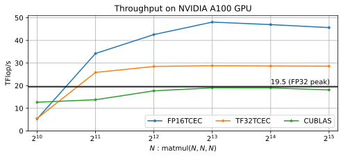

# cuMpSGEMM - CUDA Mutable-precision SGEMM

A library for executing SGEMM emulation on Tensor Cores intercepting the cuBLAS function calls for A100 GPU.

## Supported functions
- `cublasSgemm`
- `cublasCgemm`
- `cublasGemmEx` (Only for single precision)

## Throughput


## Build

```
git clone https://github.com/enp1s0/cuMpSGEMM.git --recursive
cd cuMpSGEMM
mkdir build
cd build
cmake ..
# It may take ~15 min
make -j4
```

## Usage

### 1. Hijack cuBLAS library
Before executing a target application, set an environmental variable as follows.
```bash
export LD_PRELOAD=/path/to/cumpsgemm/build/libcumpsgemm.so:$LD_PRELOAD
```

### 2. Control SGEMM computing mode
By the default rule, the SGEMM computing mode can be changed via an environmental variable as follows:

```bash
export CUMPSGEMM_COMPUTE_MODE=FP16TCEC
```

#### Performance modes
| mode name            | Tensor Core Type               | Error Correction |
|:---------------------|:-------------------------------|:-----------------|
|`FP16TCEC`            | FP16                           | Yes              |
|`TF32TCEC`            | TF32                           | Yes              |
|`CUBLAS_SIMT`         | (FP32 SIMT Core)               | No               |
|`CUBLAS_FP16TC`       | FP16                           | No               |
|`CUBLAS_TF32TC`       | TF32                           | No               |
|`FP16TCEC_SCALING`    | FP16                           | Yes              |

#### Debugging modes
| mode name            | Tensor Core Type               | Error Correction |
|:---------------------|:-------------------------------|:-----------------|
|`FP16TC`              | FP16                           | No               |
|`TF32TC`              | TF32                           | No               |
|`CUBLAS`              | Depends on the cublas math mode| No               |
|`AUTO`                | AUTO                           | Yes              |
|`DRY_RUN`             | Nothing is computed            | No               |

#### Custom rule
By defining a custom `cuMpSGEMM_get_compute_mode` function and including it in a shared library named `libcumpsgemm_rule.so`, the SGEMM mode can be changed as you want.
The default function definition is in [default_cumpsgemm_rule.cu](src/default_cumpsgemm_rule.cu).
Before executing a target application, set an environmental variable as follows.
```bash
export LD_LIBRARY_PATH=/path/to/libcumpsgemm_rule.so/dir:$LD_LIBRARY_PATH
```

## How this library works


When a supported cuBLAS function (e.g. `cublasSgemm`) is called, a function selector inside this library calls `cuMpSGEMM_get_compute_mode` function (1) to determine the backend SGEMM function (2).
Then it calls an appropriate function (3).

## Important note
To hijack the cuBLAS static library, the same name library is created.
In this process, the build script decomposes the cuBLAS static library and composes the TCEC SGEMM and decomposed modules except sgemm.o etc.
This is not the reverse engineering, decompiling or disassembling that is prohibited by [NVIDIA EULA](https://docs.nvidia.com/cuda/eula/index.html).

## Test
```
Usage : ./build/cumpsgemm_test sgemm [exp2|seq] [min_N] [max_N] [interval]
      : ./build/cumpsgemm_test cgemm [exp2|seq] [min_N] [max_N] [interval]
      : ./build/cumpsgemm_test sgemm_strided_batch [exp2|seq] [min_N] [max_N] [interval] [batch_count]
      : ./build/cumpsgemm_test cgemm_strided_batch [exp2|seq] [min_N] [max_N] [interval] [batch_count]
      : ./build/cumpsgemm_test cublas_sgemm [exp2|seq] [min_N] [max_N] [interval]
      : ./build/cumpsgemm_test cublas_cgemm [exp2|seq] [min_N] [max_N] [interval]
      : ./build/cumpsgemm_test cublas_sgemm_strided_batch [exp2|seq] [min_N] [max_N] [interval] [batch_count]
      : ./build/cumpsgemm_test cublas_cgemm_strided_batch [exp2|seq] [min_N] [max_N] [interval] [batch_count]
      : ./build/cumpsgemm_test log [/path/to/log]
```

## Controlling environmental variables
```bash
# Select a GEMM implementation executing (See the table above)
export CUMPSGEMM_COMPUTE_MODE=FP16TCEC

# Output debug information (default: 0)
export CUMPSGEMM_INFO=1

# Output error message (default: 1)
export CUMPSGEMM_ERROR_LOG=0

# Enable custom gemm_Mx2x2 (https://github.com/enp1s0/cuGEMM-Mx2x2)
export CUMPSGEMM_CUSTOM_GEMM_MX2X2=1
```

### CULiP integration
To output [CULiP](https://github.com/enp1s0/CULiP) logs, specify a following environmental variable.
```bash
export CUMPSGEMM_ENABLE_CULIP_PROFILING=1
```

## Citation
```bibtex
@InProceedings{10.1007/978-3-031-32041-5_14,
	author="Ootomo, Hiroyuki
	and Manabe, Hidetaka
	and Harada, Kenji
	and Yokota, Rio",
	title="Quantum Circuit Simulation by SGEMM Emulation on Tensor Cores and Automatic Precision Selection",
	booktitle="High Performance Computing",
	year="2023",
	publisher="Springer Nature Switzerland",
	address="Cham",
	pages="259--276",
	isbn="978-3-031-32041-5"
}
```

## License
MIT
